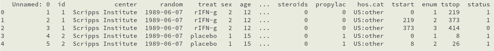
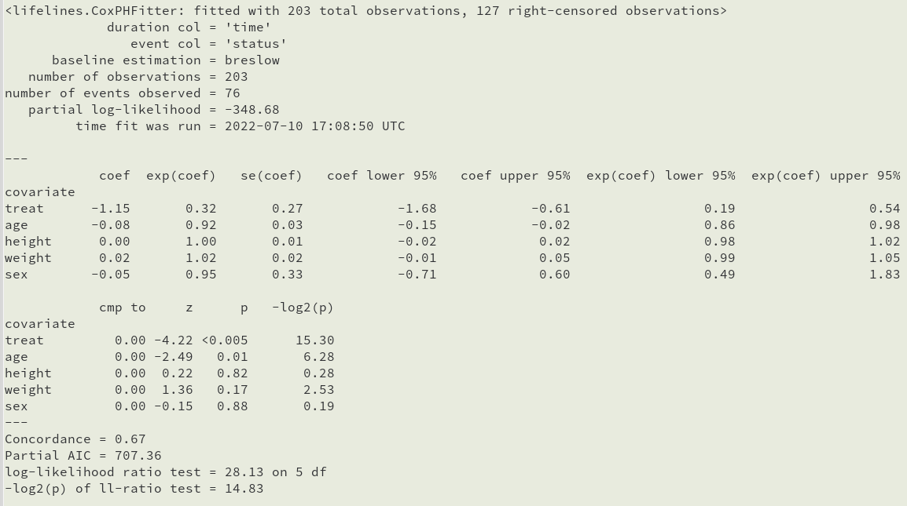

---
output:
  pdf_document:
    latex_engine: xelatex
 
mainfont: DejaVuSerif.ttf
sansfont: DejaVuSans.ttf
monofont: DejaVuSansMono.ttf 

mainfontoptions:
- Extension=.ttf
- UprightFont=*
- BoldFont=*-Bold
- ItalicFont=*-Italic
- BoldItalicFont=*-BoldItalic

numbersections: true
indent: true

header-includes:
- \usepackage{indentfirst}
- \usepackage[russian]{babel}
---
\input{./src/title.tex}
\input{./src/extra.tex}

\begin{center} 
    {\Large Отчет студента}
\end{center}

\tableofcontents
\clearpage

# Что такое "Анализ выживаемости"? 

*Анализ выживаемости* --- набор статистических моделей, благодаря которым можно оценить вероятность наступления того или иного события.
Анализ занимается моделированием процессов наступления *интересующих* нас (критических) событий для элементов той или иной совокупности (изначально --- «смерти» для элементов совокупности живых существ). 

*Интересным* событием может быть что угодно. Это может быть фактическая смерть, рождение, выход на пенсию и т. д.

Название *"survival analysis"* взято из медицины, т.к. цель анализа заключается в изучении продолжительности жизни пациента после приема препарата или других факторов влияния на здоровье. 

## Основные понятия

### Функция выживания (Survival function)

Пусть $T$ --- неотрицательная случайная величина, представляющая собой время ожидания до наступления некоторого события.
Для простоты будем использовать терминологию анализа выживаемости, называя исследуемое событие «смертью», а время ожидания --- временем «выживания»

*Функция выживания* сопоставляет некоторому числу $t$ вероятность того, что случайная величина $T$ примет значение, не меньшее $t$. Иначе говоря, это вероятность того, что некоторое состояние «проживет» как минимум $t$ единиц времени:

$$S(t) = \mathbb{P}\{T > t\} = 1 - \mathbb{P}\{T \leq t\}$$

Например, если мы хотим знать, какова вероятность того, что безработный индивид не сможет найти работу в течение полугода после начала поиска, то достаточно рассмотреть функцию выживания для $t = 6$ месяцев.

### Функция риска (Hazard function)

*Функцию риска* можно охарактеризовать как вероятность того, что событие произойдет за бесконечно малый интервал времени, при условии, что оно не произошло к моменту времени $t$.

$$h(t) = \lim_{dt \to 0}\frac{\mathbb{P} (t \leq T < t + dt|T \geq t)}{dt}$$

Числитель этого выражения --- условная вероятность того, что событие произойдет в интервале $(t, t + dt)$, если оно не произошло ранее, а знаменатель --- ширина интервала. Разделив одно на другое, получаем интенсивность осуществления события в единицу времени. Устремляя ширину интервала к нулю и переходя к пределу, получаем *мгновенную интенсивность осуществления события*.

Т. к. вышеперечисленные функции связаны друг с другом, можно показать, что:

$$S(t) = \exp{(-\int_{0}^{t}h(x)dx)}$$

Интеграл в фигурных скобках в этом уравнении называют *кумулятивным риском* и обозначают как:

$$H(t) = \int_{0}^{t}h(x)dx$$

Можно рассматривать $H(t)$ как сумму всех рисков при переходе от момента времени 0 к $t$.

### Цензурирование (censoring)

*Цензурирование* --- вид неполноты информации, при котором наблюдения не содержат точной длительности изучаемого состояния. Различают цензурирование справа, слева и интервальное:

1. Цензурировано справа --- о наблюдаемом состоянии известно лишь, что оно продлилось не менее определенного времени.
1. Цензурировано слева --- о состоянии известно лишь, что оно продлилось не более определенного времени.
1. На интервале --- известны только границы длительности.

### Медиана ожидаемого времени жизни (median number of survival days)

Это точка на временной оси, в которой кумулятивная функция выживания равна 0,5.

Другими словами, *медиана* --- время, когда ожидается, что половина пациентов будет жива. Это означает, что шанс выжить после этого времени составляет 50%.

### Доверительный интервал (confidence interval)

 Доверительный интервал --- интервал, который покрывает неизвестный параметр с заданной надёжностью.
 Вероятность, с которой в условиях данного эксперимента полученные экспериментальные данные можно считать надежными (достоверными), называют *доверительной вероятностью* или надежностью. Величина доверительной вероятности определяется характером производимых измерений. Мы будем считать доверительную вероятность равной 95 %.

### Усечение (truncation)

*Усечением*, или урезанием, называется вид неполноты информации, при котором какая-то область возможных значений длительности оказывается недостаточно представленной в выборке: состояния, длительность которых слишком велика или, наоборот, слишком мала, просто не включаются в анализируемые данные. В нашей задаче мы будем называть их (removed) --- пациенты, которые больше не являются частью нашего эксперимента. Если человек умирает или подвергается цензуре, то он попадает в эту категорию.

## Непараметрические методы оценивания распределения длительностей 

При отсутствии цензурирования и усечения для оценивания закона распределения вероятностей может использоваться эмпирическая функция распределения, из которой легко получить оценки для других характеристик случайной величины: survival function etc. Но в нашем случае это невозможно, т. к. мы имеем дело с неполнотой данных. Эту проблему решают непараметрические методы оценки.

### Оценка Каплана --- Мейера

*Оценка Каплана-Мейера* --- это непараметрическая статистика, используемая для оценки функции выживания на основе данных о жизни. В медицинских исследованиях она часто используется для измерения доли пациентов, живущих в течение определенного времени после лечения или постановки диагноза. Например: подсчет количества времени, которое прожил конкретный пациент после того, как у него был диагностирован рак или началось его лечение.

$$\hat{S}(t) = \prod_{t_{j} \leq t} {\frac{n_{j} - d_{j}}{n_{j}}}$$

где 

$\hat{S}(t) =$ Вероятность того, что испытуемый жив в момент времени $t$

$n_{j} =$ Количество испытуемых, оставшихся в живых непосредственно перед моментом времени $t_{j}$

$d_{j} =$ Количество событий в момент времени $t_{j}$

Можем переписать формулу выше так:

$$S(t_{j}) = S(t_{j-1})(1 - \frac{d_{j}}{n_{j}})$$

где

$S(t_{j}) =$ Вероятность того, что испытуемый жив в момент времени $t_{j}$

$n_{j} =$ Количество испытуемых, оставшихся в живых непосредственно перед моментом времени $t_{j}$

$d_{j} =$ Количество событий в момент времени $t_{j}$

$S(0) = 1$

$t_{0} = 0$

### Оценка Нельсона --- Аалена

Мы можем визуализировать совокупную информацию о выживании, используя функцию риска *Нельсона-Аалена $h(t)$*. Функция риска $h(t)$ дает нам вероятность того, что субъект, находящийся под наблюдением в момент времени $t$, имеет интересующее событие (смерть) в это время. Чтобы получить информацию о функции риска, мы не можем преобразовать оценку Каплана-Мейера. Для этого существует соответствующая непараметрическая оценка кумулятивной функции риска:

$$\hat{H}(t) = \sum_{t_{j} \leq t}{\frac{d_{j}}{n_{j}}}$$

где

$\hat{H}(t) =$ Кумулятивная вероятность риска 

$n_{j} =$ Количество испытуемых, оставшихся в живых непосредственно перед моментом времени $t_{j}$

$d_{j} =$ Количество событий в момент времени $t_{j}$
\pagebreak

### Модель пропорциональных рисков *(регрессионный анализ пропорциональных рисков Кокса)*

*Модели пропорциональных рисков* --- прогнозирование риска наступления события для рассматриваемого объекта и оценка влияния заранее определенных независимых переменных (предикторов) на этот риск. 

В качестве решения для этого мы используем *регрессионный анализ пропорциональных рисков Кокса*, который работает как для количественных предикторов некатегориальных переменных, так и для категориальных переменных.

*Регрессионная модель Кокса (Cox regression)* --- в анализе выживаемости математическая модель зависимости функции риска от независимых переменных-факторов. В анализе выживаемости решается задача оценки функции выживания или функций, производных от нее.

В нашей задаче мы попытаемся рассмотреть зависимость вероятности выживания от возрастной группы.

Целью метода пропорциональной риска Кокса является определение того, как различные факторы в нашем наборе данных влияют на интересующее нас событие.

$$h(t) = h_{0}(t) * \exp({b_{1}x_{1} + b_{2}x_{2} + ... + b_{n}x_{n})}$$

где

$t =$ время выживания

$h(t) =$ функция риска

$x_{1}, x_{2}, ..., x_{n} =$ ковариации

$b_{1}, b_{2}, ..., b_{n} =$ влияния параметров ковариций

$\exp{(b_{i})} =$ коэффициент риска (Hazard Ratio [HR]), 

если:

$b_{i} = 1 \Rightarrow \exp{(b_{i})} = 0 \Rightarrow$ ковариат не оказывает влияния на риск. 

$b_{i} < 1 \Rightarrow \exp{(b_{i})} = 0 \Rightarrow$ ковариат оказывает отрицательное влияние на риск $\Rightarrow$ положительное на время выживания.

$b_{i} > 1 \Rightarrow \exp{(b_{i})} = 0 \Rightarrow$ ковариат оказывает положительное влияние на риск $\Rightarrow$ отрицательное на время выживания. 
\pagebreak

# Пример решения задачи

В качестве примера для анализа выживаемости возьмем заболевание *Chronic Granulomatous Disease*

*Хроническая гранулематозная болезнь*(ХГБ)[CGD] --- это наследственное заболевание, которое возникает, когда тип лейкоцитов (фагоцитов), которые обычно помогают организму бороться с инфекциями, не работает должным образом. В результате фагоциты не могут защитить организм от бактериальных и грибковых инфекций. У людей с хронической гранулематозной болезнью могут развиться инфекции в легких, коже, лимфатических узлах, печени, желудке и кишечнике или других областях. У них также могут образовываться скопления лейкоцитов в зараженных областях. У большинства людей ХГБ диагностируется в детстве, но у некоторых людей диагноз может не ставиться до зрелого возраста.

В датасете нас интересует:

* период, в течение которого наблюдали за пациентом $(tstop - tstart)$

* пол пациента (*sex*)

* *status* = {status == 0 = alive, status == 1 = dead}

В дальнейшем может пригодиться возраст (*age*) для анализа выживаемости по группам.

## Проанализируем половое соотношение

для начала подключим необходимые библиотеки...

*lifelines* --- содержит необходимые нам методы для исследования вероятностей и времени жизни.

```{python} 
import pandas as pd
import numpy as np
import matplotlib.pyplot as plt 
from lifelines import KaplanMeierFitter
from lifelines import NelsonAalenFitter
# считываем данные
data = pd.read_csv("src/cgd.csv")
head = data.head()
```



```{python, results=FALSE, collapse=TRUE}
data.loc[data.sex == "male", "sex"] = 1 
data.loc[data.sex == "female", "sex"] = 2 
plt.hist(data["sex"]) #гистограмма "пол"
plt.show()
```

## Применяем *Оценку Каплана --- Мейера*

```{python}
kmf = KaplanMeierFitter()
# в нашем случае "status" === "dead"
data.loc[:, "time"] = data.loc[:, "tstop"] - data.loc[:, "tstart"] # time=tstop-tstart
kmf.fit(durations = data["time"], event_observed = data["status"])
```

### Сделаем таблицу событий

Нам это нужно, чтобы отделить цензурированные данные, получить необходимые временные данные для применения методов оценки.

```{python}
print(kmf.event_table)
```

где

* *event_at* --- хранит значение временной шкалы для нашего набора данных. т. е. когда пациент наблюдался в нашем эксперименте или когда был проведен эксперимент, хранит значение дней выживания для субъектов.

* *at_risk* --- хранит количество текущих пациентов, находящихся под наблюдением.

$$at\_risk = current\ patients\ at\_risk + entrance - removed$$

* *entrance* --- хранит значение новопришедших пациентов. Т. е. во время проведения эксперимента появлялись новые больные.

* *censored* --- если человек все еще жив по окончании эксперимента, то мы добавляем его в эту категорию.

* *observed* --- содержит количество умерших пациентов во время эксперимента.

* *removed* --- содержит количество пациентов, которые "выпадают" из эксперимента $removed = observed + censored$ 

### Найдем вероятность выживания для каждого момента времени и вероятность с доверительным интервалом

Для начала найдем вероятность выживания за время $t$

*(см. раздел 1.2.1)*

Не ограничивая общности, $\forall t$:
Пусть $t = 6$ $\Rightarrow$

```{python}
# Вероятность выживания после 6 дней
e0 = kmf.event_table.iloc[0, :]
e2 = kmf.event_table.iloc[1, :]
e4 = kmf.event_table.iloc[2, :]
e6 = kmf.event_table.iloc[3, :]
s0 = (e0.at_risk - e0.observed)/e0.at_risk
s2 = (e2.at_risk - e2.observed)/e2.at_risk
s4 = (e4.at_risk - e4.observed)/e4.at_risk
s6 = (e6.at_risk - e6.observed)/e6.at_risk
s6 = s0 * s2 * s4 * s6
print(s6)
```
\pagebreak

Найдем вероятность выживания $\forall t$:

```{python, results=FALSE, collapse=TRUE}
kmf.survival_function_
plt.title("Оценка Каплана-Мейера")
plt.ylabel("Вероятность выживания")
kmf.plot()
csf = kmf.confidence_interval_survival_function_
plt.plot(csf["KM_estimate_lower_0.95"], label="lower")
plt.plot(csf["KM_estimate_upper_0.95"], label="upper")
plt.show()
```

По графику видно, что с течением времени вероятность выживания уменьшается.

### Найдем медиану времени выживания

```{python}
print("Медиана времени выживания", kmf.median_survival_time_)
```
\pagebreak

### Найдем вероятность смерти для $\forall t$

Сделаем график кумулятивной функции плотности и кумулятивной плотности с доверительным критерием

```{python, results=FALSE, collapse=TRUE}
kmf.plot_cumulative_density()
ccf = kmf.confidence_interval_cumulative_density_
plt.plot(ccf["KM_estimate_lower_0.95"], label="lower")
plt.plot(ccf["KM_estimate_upper_0.95"], label="upper")
plt.title("Кумулятивная плотность (с довер. критерием)")
plt.xlabel("Кол-во дней")
plt.ylabel("Вероятность смерти")
plt.show()
```

Видим полностью обратный график к вероятности выживания, что неудивительно, ведь кумул. ф-я плотности:

$$F(t) = 1 - S(t)$$
\pagebreak

## Применяем *Оценку Нельсона --- Аалена*

```{python}
naf = NelsonAalenFitter()
naf.fit(durations = data["time"], event_observed = data["status"])
```

### Найдем риск для каждого момента времени и риск с доверительным интервалом

По нашей таблице событий *(см. раздел 2.2.1)* мы считаем функцию риска *(см. раздел 1.2.2)*

Также можем предсказать значение функции риска для $\forall t$

```{python}
print("300 дней: ", naf.predict(300))
```

```{python, results=FALSE, collapse=TRUE}
naf.plot_cumulative_hazard()
ci = naf.confidence_interval_
plt.plot(ci["NA_estimate_lower_0.95"], label="lower")
plt.plot(ci["NA_estimate_upper_0.95"], label="upper")
plt.xlabel("Кол-во дней")
plt.ylabel("Кумулятивная функция смерти")
plt.legend()
```

Другими словами, функция риска измеряет *общую сумму риска*, накопленного к моменту времени $t$

### Сравним кумулятивную функцию риска и кумулятивную плотность *(вероятность смерти)*:

```{python}
kmf.plot_cumulative_density(label="Кумулятивная плотность")
naf.plot_cumulative_hazard(label="Кумулятивная функция риска")
plt.xlabel("Кол-во дней")
plt.show()
```

## Анализ выживания для групп

Сначала сравним выживаемость для мужчин и женщин:

```{python, results=FALSE, collapse=TRUE}
kmfm = KaplanMeierFitter() # мужчины 
kmff = KaplanMeierFitter() # женщины

data.loc[data.sex == "male", "sex"] = 1 
data.loc[data.sex == "female", "sex"] = 2 

male = data.query("sex == 1")
female = data.query("sex == 2")

kmfm.fit(durations=male["time"], event_observed=male["status"], label="male")
kmff.fit(durations=female["time"], event_observed=female["status"], label="female")

# сделаем таблицы событий отдельно для м. и ж.
kmfm.event_table
kmff.event_table
print(kmfm.event_table.head())
print(kmff.event_table.head())
```

### Найдем вероятность выживания среди мужчин и женщин 

```{python, results=FALSE, collapse=TRUE}
kmfm.survival_function_
kmff.survival_function_
kmfm.plot()
kmff.plot()
plt.xlabel("Кол-во дней")
plt.ylabel("Вероятность выживания")
plt.show()
```

Несложно заметить, что вероятность выживания женщин выше, чем у мужчин. Однако такие выводы не совсем точны, т.к. мужчин много больше, чем женщин. Но до ~250 дня все равно вероятность выживания у женщин выше.

Получается, что кумулятивная плотность будет ниже у женщин

```{python, results=FALSE, collapse=TRUE}
kmfm.plot_cumulative_density()
kmff.plot_cumulative_density()
plt.title("Кумулятивная плотность")
plt.xlabel("Кол-во дней")
plt.ylabel("Вероятность")
plt.show()
```
\pagebreak

### Сравним кумулятивную плотность выживания с кумулятивной функцией риска

мужчины:

```{python, results=FALSE, collapse=TRUE}
nafm = NelsonAalenFitter()
nafm.fit(durations = data["time"], event_observed = data["status"])
kmfm.plot_cumulative_density(label="Плотность (мужчины)")
nafm.plot_cumulative_hazard(label="Риск (мужчины)")
plt.xlabel("Кол-во дней")
plt.show()
```

женщины:

```{python, results=FALSE, collapse=TRUE}
naff = NelsonAalenFitter()
naff.fit(durations = data["time"], event_observed = data["status"])
kmff.plot_cumulative_density(label="Плотность (женщины)")
naff.plot_cumulative_hazard(label="Риск (женщины)")
plt.xlabel("Кол-во дней")
plt.show()
```

$\Rightarrow$ с течением времени риск увеличивается.

### Найдем зависимость вероятности выживания от возрастной группы

```{python, results=FALSE, collapse=TRUE}
from lifelines import CoxPHFitter
data = pd.read_csv("src/cgd.csv")
data = pd.read_csv("src/cgd.csv")
data = data.drop("center", axis=1)
data = data.drop("id", axis=1)
data = data.drop("random", axis=1)
data = data.drop("steroids", axis=1)
data = data.drop("inherit", axis=1)
data = data.drop("hos.cat", axis=1)
data = data.drop("propylac", axis=1)
data = data.drop("enum", axis=1)
```
Удалим из наших данных строки с нулевыми значениями

```{python, results=FALSE, collapse=TRUE}
data = data.dropna(subset=['sex', 'age', 'treat', 'height', 
    'weight', 'tstart', 'tstop', 'status'])
```

```{python, results=FALSE, collapse=TRUE}
# возьмем объект kmf из (раздела 2.2)
data.loc[:, "time"] = data.loc[:, "tstop"] - data.loc[:, "tstart"] # time=tstop-tstart
data.loc[data.sex == "male", "sex"] = 1
data.loc[data.sex == "female", "sex"] = 2
data.loc[data.treat == "placebo", "treat"] = 1
data.loc[data.treat == "rIFN-g", "treat"] = 2
kmf.fit(durations = data["time"], event_observed = data["status"])
kmf.event_table
data = data[['time', 'treat', 'age', 'height', 'weight', 'sex', 'status']]
```

```{python, results=FALSE, collapse=TRUE}
cph = CoxPHFitter()
cph.fit(data, "time", event_col="status")
```



Мы знаем, что значение $p < 0.05$ считается статистически значимым. Здесь мы видим, что *age* имеет 0.01, *treat* менее 0.005. Поэтому рассмотрим группировку "по возрасту" и "по лечению".

Заметим, что значение *HR = exp(coef)* для *age* равно 0.92, $\Rightarrow$ слабая зависимость риска смерти от возраста пациента, т.к если остальные ковариаты = const, $\Rightarrow$ если вы относитесь к взрослой возрастной группе, то имеете на 8% меньше смертельный риск, чем, например, дети. Для *treat* ситуация такая: т.к. *HR* равна 0.32, $\Rightarrow$ сильная зависимость риска смерти от вида лечения: пациенты, принимающие *rIFN-g(Interferon gamma)*, имеют на 68% меньше смертельный риск, нежели те, кому давали *placebo*.
\pagebreak

Построим график, чтобы убедиться в наших предположениях:

```{python}
cph.plot()
```

Рассмотрим некоторых пациентов, чтобы убедиться в правильности оценки наших параметров, влияющих на смертельный риск

```{python}
print(data.iloc[46:51, :])
```

```{python}
ddata = data.iloc[46:51, :]
cph.predict_survival_function(ddata).plot()
plt.show()
```

Из-за того, что основным весомым параметром у нас получился *treat*, видно, что пациент (#46) имеет самую низкую вероятность выживания, а пациент (#47) мало того, что самый взрослый, так еще и принимал лекарство *rIFN-g*, поэтому имеет максимальную вероятность выживания среди данной выборки.
\pagebreak

# Итоги

Проанализировав выживаемость пациентов с заболеванием CGD, можно сказать, что вероятность выживания со временем падает $\Rightarrow$ чем больше времени проходит, тем больше смертельный риск.

Анализ показал, что на нашей выборке у женщин немного больше шансов на выживание, нежели у мужчин. Выживаемость в старших возрастных группах на ~8% выше, чем в младших. Также мы выяснили, что если пациент принимает лекарство, а не плацебо, то вероятность смертельного исхода значительно падает --- на ~68%.

## Список материалов

* https://towardsdatascience.com/force-of-mortality-in-bathtub-shaped-lifetimes-b0425cb66925

* https://pub.towardsai.net/survival-analysis-with-python-tutorial-how-what-when-and-why-19a5cfb3c312

* "Анализ панельных данных и данных о длительности состояний", Ратникова Т.А., Фурманов К.К.

* https://www.ncbi.nlm.nih.gov/pmc/articles/PMC2394368/

* http://www-eio.upc.edu/~pau/cms/rdata/datasets.html

* https://wiki5.ru/wiki/Proportional_hazards_model

* http://statsoft.ru/home/textbook/modules/stsurvan.html
